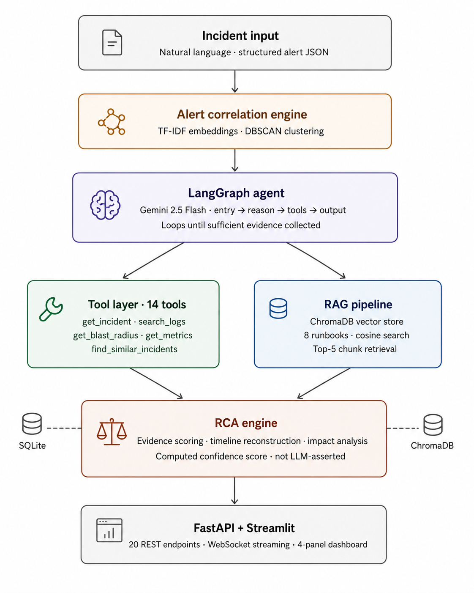
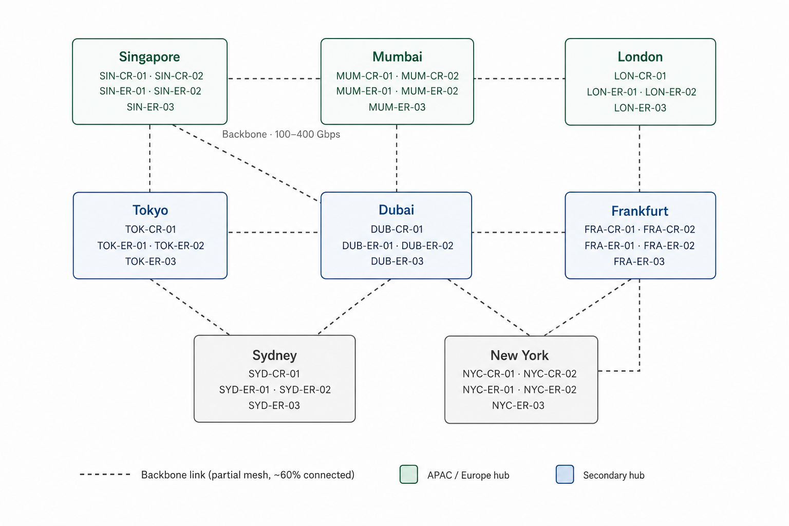
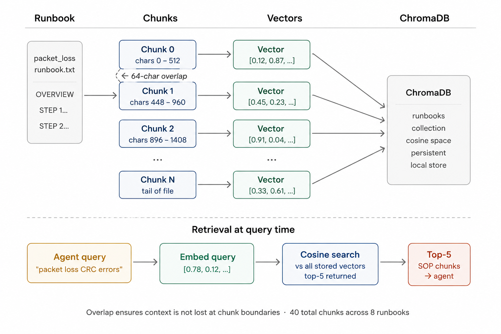
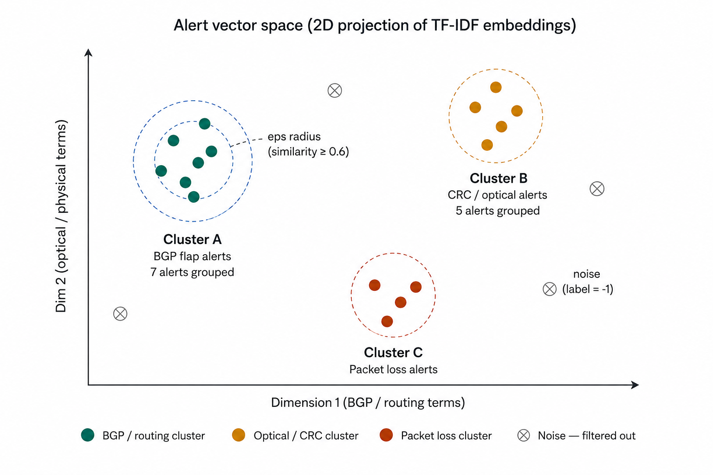
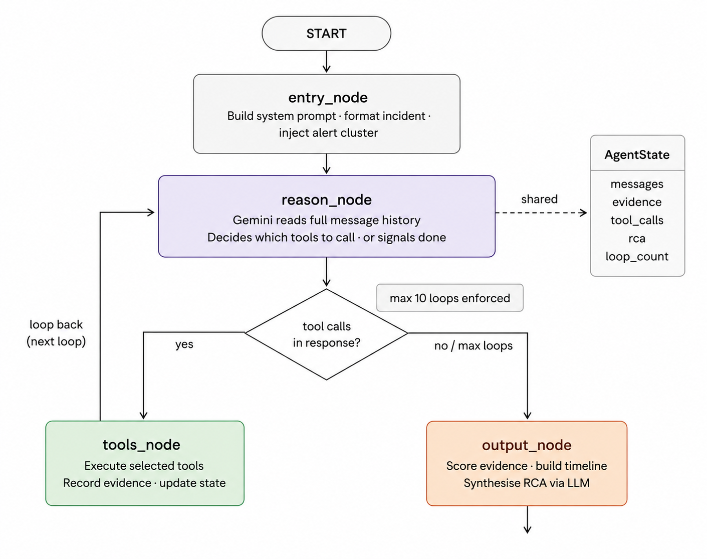
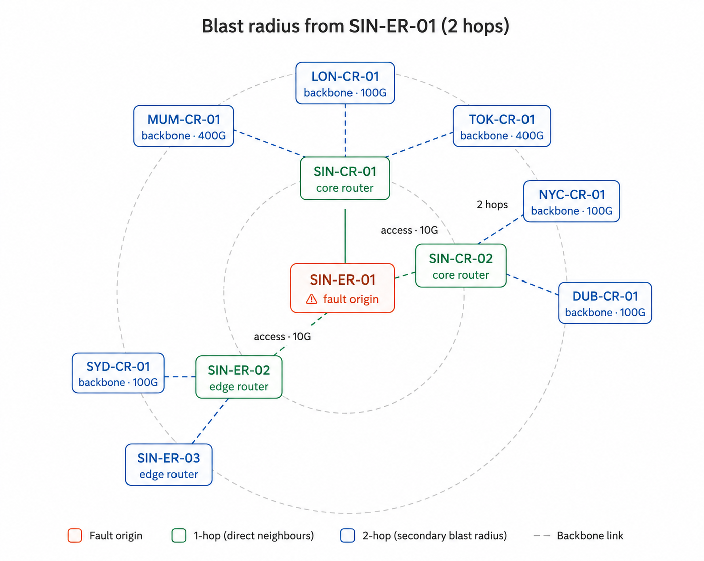
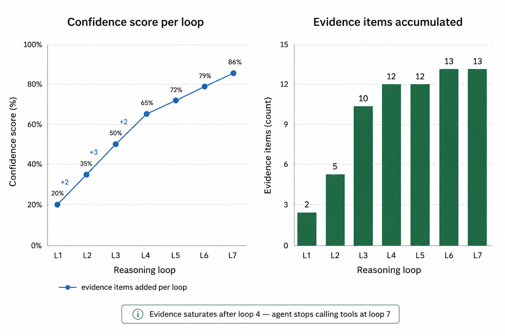
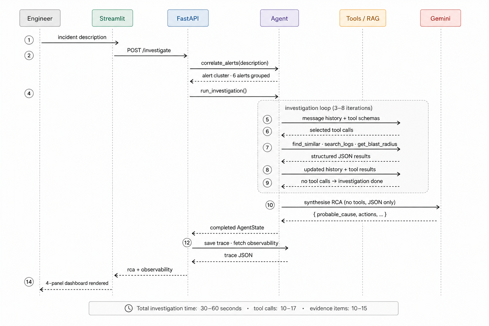

# AI NOC Copilot — Technical Deep Dive

> This document explains how every layer of the system works,
> what decisions were made and why, and how data flows from
> an incoming alert to a structured RCA output.
>
---

## Table of Contents

1. [System Overview](#1-system-overview)
2. [Layer 0 — Synthetic Data](#2-layer-0--synthetic-data)
3. [Layer 1 — Storage](#3-layer-1--storage)
4. [Layer 2 — Alert Correlation Engine](#4-layer-2--alert-correlation-engine)
5. [Layer 3 — LangGraph Agent](#5-layer-3--langgraph-agent)
6. [Layer 4 — MCP Tool Layer + RAG](#6-layer-4--mcp-tool-layer--rag)
7. [Layer 5 — RCA Engine](#7-layer-5--rca-engine)
8. [Layer 6 — API + UI](#8-layer-6--api--ui)
9. [AI Observability](#9-ai-observability)
10. [Design Decisions](#10-design-decisions)
11. [Data Flow — End to End](#11-data-flow--end-to-end)

---

## 1. System Overview

The AI NOC Copilot is a seven-layer system. Each layer has a single responsibility and a clean interface to the layers above and below it.

```
Layer 6  →  FastAPI backend + Streamlit UI
Layer 5  →  RCA engine (evidence scoring + timeline reconstruction)
Layer 4  →  Modular tool layer + RAG pipeline
Layer 3  →  LangGraph agent (orchestration loop)
Layer 2  →  Alert correlation engine
Layer 1  →  SQLite + ChromaDB (storage)
Layer 0  →  Synthetic data (incidents, alerts, logs, runbooks, topology)
```



The key architectural principle is that the agent never stores state between
invocations. Every investigation starts fresh, the agent builds up its
`AgentState` object as it works, and that object is discarded when the
investigation completes (its trace is saved separately for observability).

---

## 2. Layer 0 — Synthetic Data

### Why synthetic data?

Synthetic data generated to match the structure and
behaviour of real data serves the same purpose for building and demonstrating
the system.

### What is generated

| File | Count | Format | Purpose |
|---|---|---|---|
| `data/incidents/incidents.json` | 80 records | JSON array | Historical incident database |
| `data/alerts/alerts.json` | 277 records | JSON array | Monitoring alert stream |
| `data/logs/*.log` | 40 files | Syslog text | Raw device logs |
| `data/runbooks/*.txt` | 8 files | Plain text SOP | RAG knowledge base |
| `data/topology/topology.json` | 33 nodes, 36 edges | JSON graph | Network dependency map |

### How incidents are generated

Each incident has a full lifecycle: detected → acknowledged → resolved.
Faker generates names, IDs, and timestamps. Template strings produce
realistic descriptions based on symptom type. For example:

```
symptom: bgp_flap →
"BGP session instability on {device} ({region}).
 Session flapping every 2-3 minutes. Routing table unstable."
```

### How logs are generated

Syslog lines mimic real Cisco/Juniper output with accurate error codes:

```
Apr 09 18:08:03 SIN-CR-01 : %BGP-5-ADJCHANGE: neighbor 10.x.x.x Down Hold Timer Expired
Apr 09 18:09:03 SIN-CR-01 : %LINK-3-UPDOWN: Interface GigabitEthernet0/1, changed state to down
```

The error code format `%FACILITY-SEVERITY-MNEMONIC` is exactly how real Cisco
devices emit logs. The timeline reconstruction module relies on this format.

### How topology is generated

NetworkX builds a realistic backbone graph:
- Each region (8 total) gets 1-2 core routers and 2-3 edge routers
- Edge routers connect to their regional core routers
- Core routers across regions are partially meshed (~60% connection probability)
- Backbone links have 100Gbps or 400Gbps capacity
- Access links have 10Gbps capacity



### Why runbooks are hand-written

The runbooks are the most important data in the system because they are what
the RAG pipeline retrieves and presents to the LLM as grounding context.
A low-quality runbook produces a low-quality RCA. All 8 runbooks were written
to match the structure of real network engineering SOPs:

1. `packet_loss_troubleshooting.txt`
2. `bgp_flap_runbook.txt`
3. `high_latency_runbook.txt`
4. `optical_degradation_runbook.txt`
5. `mpls_failure_runbook.txt`
6. `cpu_spike_runbook.txt`
7. `dns_outage_runbook.txt`
8. `interface_down_runbook.txt`

### Data layer — demo vs production

It is worth being explicit about how this synthetic layer differs from a real
deployment, because the differences shape the whole architecture.

**How the demo generates data (top-down).** `scripts/generate_data.py` builds
data in this order: topology → incidents → alerts → logs → runbooks. Crucially,
**incidents are created first and alerts/logs are derived downward from them** —
`generate_alerts(incidents)` stamps each child alert with its parent incident's
`incident_id`, `device`, `region`, and `symptom`. So the demo starts with the
answer (a fully-formed incident, root cause included) and manufactures the
symptoms that incident would have produced.

**Production is the inverse (bottom-up).** Raw alerts arrive first as an
unbounded stream with no incident label; correlation groups them into a
*candidate* incident; RCA then derives the root cause; and the incident record
is only written at resolution time.

```
DEMO (top-down):       incident (root cause KNOWN) → spawn alerts/logs
                       → correlate alerts → agent "re-discovers" the incident

PRODUCTION (bottom-up): raw alert stream (unlabeled) → correlate into candidate
                       → RCA derives root cause → incident record CREATED
```

| Aspect | This demo | Production |
|---|---|---|
| Input | Static JSON, pre-normalised, pre-labeled | Continuous stream of **unlabeled** raw events |
| Sources | A `source` string ("Prometheus", "Nagios"…) on one unified schema | Genuinely different vendor formats needing a **normalisation layer** |
| Metrics | A single scalar per alert (`metric_value`) | **Time-series** in Prometheus; an alert is the output of an Alertmanager rule |
| Transport | A file read by `load_alerts()` | An **event bus** (Kafka / Pulsar) — durable, replayable, buffers storms |
| Correlation | Batch over a static list | **Streaming / windowed**, keyed on time + topology, text as a tiebreaker |
| `incident_id` on alerts | Present (artifact of generating top-down) | Does **not** exist at alert time — it is an output, not an input |

**Two honest caveats about the synthetic data:**

1. **`incident_id` on raw alerts is a leak of the answer into the input.** In
   production that field is produced by correlation/RCA, not present on the raw
   alert. The live correlation path here already respects this — it clusters by
   description/recency and never reads `incident_id`; the field is best understood
   as a **post-hoc ground-truth label** kept only so correlation quality can be
   evaluated, not as a runtime feature.
2. **`root_cause` is drawn independently of `symptom`** (`random.choice` for each),
   and every downstream artifact — alerts, logs, metrics, description — is
   generated from `symptom`, never from `root_cause`. So there is no learnable
   signal connecting the evidence to the true root cause. The demo therefore
   proves the **reasoning pipeline**, not RCA **accuracy** — to measure accuracy
   you would need a generator where the root cause causally drives the symptoms
   and log signatures.

**What we would use in production:** Prometheus + Alertmanager (metrics and
alert rules), Fluent Bit/Vector → Loki/Elasticsearch (logs), Kafka (the event
bus), a stream processor (Kafka Streams / Flink) holding a time window for
incremental correlation, and a CMDB / topology service to enrich each alert
with its dependency neighbours.

---

## 3. Layer 1 — Storage

Two separate stores serve two different purposes.

### SQLite — structured relational storage

SQLite stores incidents and alerts in two relational tables:

```sql
incidents (
    incident_id TEXT PRIMARY KEY,
    severity TEXT,
    region TEXT,
    affected_device TEXT,
    symptom TEXT,
    root_cause TEXT,
    description TEXT,
    customer_segment TEXT,
    affected_customers INTEGER,
    detected_at TEXT,
    resolved_at TEXT,
    mttr_minutes INTEGER,
    resolution TEXT
)

alerts (
    alert_id TEXT PRIMARY KEY,
    incident_id TEXT,              -- foreign key to incidents
    device TEXT,
    severity TEXT,
    alert_type TEXT,
    message TEXT,
    metric_name TEXT,
    metric_value REAL,
    timestamp TEXT,
    FOREIGN KEY (incident_id) REFERENCES incidents(incident_id)
)
```

The foreign key between alerts and incidents is important — it lets the agent
call `get_alerts_for_incident(incident_id)` and get all related alerts
in a single query.

### ChromaDB — vector store for RAG

ChromaDB stores embedded runbook chunks. Each runbook is split into overlapping
512-character chunks with 64-character overlap:

```
Chunk 0: chars 0-512
Chunk 1: chars 448-960    (64-char overlap with chunk 0)
Chunk 2: chars 896-1408   (64-char overlap with chunk 1)
...
```

The overlap ensures that a sentence cut at a chunk boundary still appears
with enough context in the next chunk. Each chunk is stored with metadata:

```json
{
  "id": "packet_loss_troubleshooting_chunk_3",
  "document": "STEP 2 — CHECK FOR CRC ERRORS...",
  "metadata": {
    "source": "packet_loss_troubleshooting.txt",
    "chunk_index": 3
  }
}
```

At query time, the agent's natural language symptom description is embedded
and compared against all stored chunks using cosine similarity. The top-5
most similar chunks are returned as context.



---

## 4. Layer 2 — Alert Correlation Engine

### The problem

A single network incident can generate 10-100 alerts simultaneously.
A BGP flap triggers a BGP session alert, then downstream packet loss alerts
on every affected interface, then latency alerts for every customer circuit
on those interfaces, then SLA breach warnings. These are all symptoms of the
same root cause but they appear as separate alerts in monitoring systems.

If the agent receives all 100 alerts individually, it wastes time and context
window on noise. Alert correlation solves this by grouping related alerts into
a single clean cluster before the agent investigates.

### How it works — Step 1: Embedding

Each alert is converted to a text representation:

```
{message} {message} {alert_type} {severity} {region} {device} {metric_name}
```

The message is repeated to give it higher weight in the TF-IDF calculation.
This text is fed into a TF-IDF vectoriser with:
- `ngram_range=(1, 2)` — considers single words AND adjacent word pairs
- `max_features=500` — top 500 most informative terms
- `stop_words="english"` — ignores common words
- `sublinear_tf=True` — dampens very high term frequencies

The result is a 500-dimensional sparse vector per alert where informative
words (BGP, CRC, packet_loss, GigabitEthernet) have high values and
noise words have near-zero values.

### How it works — Step 2: Clustering

All alert vectors are L2-normalised so that cosine similarity equals the dot
product (faster to compute). A pairwise cosine similarity matrix is computed:

```
similarity[i][j] = cosine similarity between alert i and alert j
```

This is converted to a distance matrix: `distance = 1 - similarity`
and clipped to [0, 2] to avoid floating point negatives.

The clustering backend is **pluggable**. Label assignment is the only step
that differs between backends — embedding, the distance matrix above, and
cluster building are all shared — so the two backends produce interchangeable
output for the rest of the pipeline.

**Default — average-linkage agglomerative clustering** runs on the distance
matrix:
- `distance_threshold = 0.4` — the dendrogram is cut here (0.6 similarity),
  so the number of clusters is discovered automatically rather than specified
- `linkage = "average"` — two groups are merged on the *mean* pairwise
  distance between their members, not the single closest pair
- `metric = "precomputed"` — uses our distance matrix directly

We don't need to specify the number of clusters upfront — cutting the
dendrogram at a distance threshold discovers them automatically, which is
essential when you don't know in advance how many distinct incidents an
alert batch contains. Average linkage is chosen specifically to resist
**chaining**: with single-linkage clustering, a lone bridging alert (e.g. a
generic "high latency" message) that is similar to two otherwise-unrelated
incidents can glue them into one cluster, silently merging two investigations.
Averaging over all members prevents that.

**Fallback — DBSCAN** is retained and invoked automatically if agglomerative
clustering raises at runtime:
- `eps = 0.4` — alerts within 0.4 distance (0.6 similarity) are neighbours
- `min_samples = 1` — even single alerts form a cluster
- `metric = "precomputed"` — uses our distance matrix directly

Note that with `min_samples = 1` every alert is a core point, so DBSCAN here
degenerates to single-linkage / connected-components clustering and never
labels anything as noise (`-1`). This is why it sits behind agglomerative as
a fallback rather than the primary backend.

Either way, **no alert is ever discarded** — every alert, including isolated
ones, is assigned to a cluster (its own single-member cluster if nothing else
is similar). This is intentional: in a production NOC, a single outlier alert
may represent an early fault signal or a novel failure mode not yet seen in
the alert stream. The cost of a false negative (missing a real signal)
outweighs the cost of a false positive (agent investigates a spurious alert).
Noise reduction in this system refers to dimensionality compression — N raw
alerts are reduced to K cluster summaries (where K << N) before the agent
investigates. The agent reasons over cluster summaries, not individual alerts,
which reduces context window consumption and eliminates redundant signal.



### Output

The clusterer returns an `AlertCluster` object:

```python
AlertCluster(
    cluster_id="CLU-001",
    dominant_symptom="bgp_flap",
    dominant_severity="CRITICAL",
    affected_devices=["SIN-ER-01", "SIN-CR-01"],
    affected_regions=["Singapore"],
    total_alert_count=12,
    time_span_minutes=3.6,
    root_alerts=[...],       # top 3 most representative alerts
    summary="12 alerts correlated — dominant: bgp_flap (CRITICAL) across 2 devices."
)
```

This cluster summary is injected into the agent's opening message so the
first reasoning loop already has a clean picture of the situation.

---

## 5. Layer 3 — LangGraph Agent

### What is LangGraph?

LangGraph is a framework for building stateful, multi-step agentic workflows
as directed graphs. Each node in the graph is a Python function that reads
and modifies a shared state object. Edges determine which node runs next,
and conditional edges let you implement loops and branching.

### The investigation graph

The NOC agent graph has four nodes:

```
START → [entry] → [reason] → [tools] → [reason] → ... → [output] → END
                     ↑___________________________|
                          (loop until done)
```



### Node 1 — entry_node

Runs once at the start. Responsibilities:
- Initialises the message history with the system prompt
- Formats the incident description as the first user message
- Injects the alert cluster summary if one exists
- Sets `loop_count = 0`

The system prompt is critical — it tells the LLM its persona, investigation
strategy, and which tools to prioritise. Key instructions:

```
- Always call find_similar_incidents early
- Always call get_runbook — it grounds your answer in real procedures
- Call get_blast_radius if you have a device ID
- Do NOT call the same tool twice with the same parameters
- Stop when you have: logs + similar incidents + runbook + topology
```

### Node 2 — reason_node

The thinking step. Runs at the start of every loop. Responsibilities:
- Converts message history to LangChain message objects
- Calls Gemini 2.5 Flash with all 14 tools bound via `bind_tools()`
- Stores the response (which may contain tool calls) in message history
- Records the loop in the observability tracer

When Gemini sees the current message history and the tool schemas,
it decides which tools to call and with what parameters. The tool
schemas are auto-generated from the `@tool` decorated functions —
Gemini reads the function signature and docstring to understand
what each tool does and when to use it.

### Router — should_continue

After every reason_node call, LangGraph calls this function to determine
the next node:

```python
def should_continue(state):
    if state.loop_count >= MAX_TOOL_CALLS:
        return "output"      # safety limit reached
    if last_message_has_tool_calls(state):
        return "tools"       # agent wants to call tools
    return "output"          # agent is done investigating
```

The `MAX_TOOL_CALLS` limit (default: 10) prevents infinite loops.
In practice the agent typically completes in 3-8 loops.

### Node 3 — tools_node

Executes whichever tools the agent selected. For each tool call:
1. Looks up the tool function in `TOOL_MAP`
2. Invokes it with the LLM-provided parameters
3. Times the execution with `time.perf_counter()`
4. Serialises the result to JSON and appends to message history
5. Records to the observability tracer
6. Extracts an `EvidenceItem` with type and weight
7. Extracts key fields (device, region, symptom) into state

The message history append is the key mechanism — it means the next
reasoning loop sees the tool result and can reason about it.

### Node 4 — output_node

Runs once at the end. Responsibilities:
1. Calls `enrich_rca_with_evidence()` to compute the confidence score
2. Calls `build_timeline()` to reconstruct the incident timeline
3. Calls `_build_impact()` to assemble the impact analysis
4. Calls Gemini one final time (without tools) to synthesise the RCA JSON
5. Parses the JSON response into the RCAOutput object
6. Saves the trace file

The final Gemini call uses a structured prompt that asks for a specific
JSON format. This separates the reasoning phase (tool calls) from the
synthesis phase (final answer), which produces more consistent output.

### State object

The `AgentState` Pydantic model is the "investigation notebook" —
it carries everything between nodes:

```python
AgentState(
    # Input
    incident_description: str,
    incident_id: Optional[str],
    alert_cluster: Optional[dict],

    # Progress
    messages: list[dict],          # full LLM conversation
    tool_calls: list[ToolCallRecord],
    evidence: list[EvidenceItem],
    loop_count: int,

    # Intermediate findings
    identified_symptom: Optional[str],
    identified_region: Optional[str],
    identified_device: Optional[str],
    similar_incidents_found: list[dict],
    raw_logs: list[dict],
    raw_alerts: list[dict],
    topology_data: Optional[dict],
    runbook_chunks: list[dict],

    # Output
    rca: RCAOutput,
    investigation_complete: bool,
)
```

---

## 6. Layer 4 — Tool Layer + RAG

### MCP-inspired tool design

The tools are designed following Model Context Protocol principles:
each tool has a single responsibility, a defined schema, and is
decoupled from the agent logic. The agent selects tools dynamically
based on the incident context — the selection is not hardcoded.

The `@tool` decorator from LangChain does three things:
1. Generates a JSON schema from the function signature
2. Registers the docstring as the tool description (the LLM reads this)
3. Makes the function callable by the LangGraph agent

The docstrings are written specifically for the LLM, not for humans:

```python
@tool(name="find_similar_incidents")
def tool_find_similar_incidents(symptom: str = None, region: str = None, limit: int = 5):
    """
    Search historical incidents matching a symptom, region, or root cause.
    Use this early in every investigation — past incidents reveal likely root causes.
    Symptom options: packet_loss, high_latency, bgp_flap, interface_down,
    crc_errors, cpu_spike, memory_exhaustion, mpls_failure, dns_outage,
    optical_degradation.
    """
```

### The 14 tools

| Tool | Source | Returns |
|---|---|---|
| `get_incident` | SQLite | Full incident record |
| `find_similar_incidents` | SQLite | Historical matches |
| `get_recent_incidents` | SQLite | Latest incidents |
| `get_alerts_for_incident` | SQLite | Linked alerts |
| `get_critical_alerts` | SQLite | Recent CRITICAL alerts |
| `search_logs` | Log files | Matching syslog lines |
| `get_error_summary` | Log files | Error code counts |
| `get_blast_radius` | NetworkX | Affected devices within N hops |
| `get_neighbors` | NetworkX | Directly connected devices |
| `get_region_devices` | NetworkX | All devices in a region |
| `get_device_metrics` | Simulated | CPU, memory, packet loss, latency |
| `get_metrics_history` | Simulated | Hourly metric snapshots |
| `get_runbook` | ChromaDB | Relevant SOP chunks |
| `list_runbooks` | Filesystem | Available runbook catalogue |

### RAG retrieval in detail

When the agent calls `get_runbook(symptom="packet loss with CRC errors")`:

1. The query text is embedded using the same embedding function as the stored chunks
2. ChromaDB computes cosine similarity between the query vector and all stored chunk vectors
3. The top-5 most similar chunks are returned with their source filenames
4. These chunks are formatted into the tool result string
5. The tool result goes into message history
6. The next reasoning loop has the runbook content as context

This means the LLM's RCA is grounded in the actual SOP steps rather than
relying purely on training data. If the SOP says "check CRC errors on the
interface", the LLM will include that in its recommendations.

### Topology traversal

The topology module uses NetworkX's graph algorithms:

- `get_blast_radius(device, hops=2)` — BFS from the affected device up to N hops:
  ```python
  nx.single_source_shortest_path_length(G, device_id, cutoff=hops)
  ```
  Returns all devices reachable within 2 hops, grouped by region.
  This tells the agent how far an outage could cascade.

- `get_path_between(a, b)` — Dijkstra's shortest path:
  ```python
  nx.shortest_path(G, device_a, device_b)
  ```
  Useful for tracing the network path between an affected device and a data centre.



---

## 7. Layer 5 — RCA Engine

### Evidence scoring

The confidence score is computed from collected evidence, not asserted by the LLM.
This is the key design decision that makes the RCA auditable.

**Evidence weights:**

| Evidence type | Base weight | Max contribution |
|---|---|---|
| `log` | 0.30 | 0.55 |
| `historical_incident` | 0.25 | 0.45 |
| `runbook` | 0.20 | 0.20 |
| `alert` | 0.15 | 0.30 |
| `topology` | 0.10 | 0.10 |
| `metric` | 0.10 | 0.15 |

The max contribution cap prevents a single evidence type from dominating.
For example, if the agent calls `search_logs` 5 times and gets results each
time, the log evidence doesn't keep accumulating beyond 0.55 — having 5 log
signals is useful but shouldn't alone push confidence to 90%.

**Normalisation:**

```python
perfect_score = sum(MAX_WEIGHT_PER_TYPE.values())  # ~1.85
raw_score = sum(capped_weights.values())
confidence = min(raw_score / perfect_score, 1.0)
```

A "perfect investigation" would have strong evidence in all types.
Normalising against this theoretical maximum means confidence reflects
how complete the investigation was, not just how many tool calls were made.



### Timeline reconstruction

The timeline module reads from three sources in priority order:

1. `state.raw_alerts` — ISO timestamp, structured, reliable
2. `state.raw_logs` — syslog format `Apr 09 18:08:03`, requires parsing
3. `state.similar_incidents_found` — ISO timestamp, anchor points only

**Timestamp parsing:**

Syslog format: `Apr 09 18:08:03` → parsed to `datetime(year, 4, 9, 18, 8, 3)`
ISO format: `2025-04-09T18:08:03` → parsed with `datetime.fromisoformat()`

Both are normalised to naive datetimes for consistent sorting.

**Event classification:**

Each log line is matched against 16 regex patterns:

```python
(r"bgp.*(down|adjchange|notification|hold.timer)", "bgp_drop"),
(r"interface.*(down|updown)",                      "interface_down"),
(r"crc.error",                                     "crc_error"),
(r"optical.*(los|power|signal|degrad)",            "optical_degradation"),
...
```

**Deduplication:**

Two events are duplicates if they have the same `event_type`, same `device`,
and timestamps within 30 seconds of each other. This handles the common case
where the same fault appears in both the alert stream and the syslog.

**Customer impact inference:**

The timeline automatically inserts a `customer_impact` event at the
timestamp of the first CRITICAL event. This marks when the SLA clock started —
a concept that matters directly to enterprise customers and their account teams.

### Feedback loop — currently open (future work)

When an investigation finishes, the RCA result is written into `state.rca`
(probable cause, recommended actions, escalation team, summary, timeline,
impact), returned to the API/UI, and saved to a **trace file** for the audit
trail. What it is **not** is persisted as a new incident: nothing performs an
`INSERT` into the incident store outside the seeding scripts
(`generate_data.py` / `init_db.py`). The historical corpus stays frozen at its
seeded records.

This means the loop is **open**: `find_similar_incidents` only ever retrieves
from the pre-seeded incidents, so the system never learns from incidents it has
itself resolved. Every investigation starts from the same fixed history.

**Closing the loop in production:**

```
raw alerts → correlate → candidate incident → RCA → [human confirms] → WRITE incident
                                                                          │
                                          ┌───────────────────────────────┘
                                          ▼
            becomes future retrieval context for find_similar_incidents
```

After a human confirms the agent's diagnosis, the resolved incident would be
written back to the store with its RCA-derived `root_cause`, the `resolution`,
the computed `mttr_minutes` (resolved_at − detected_at), and the confirming
engineer. That record then becomes retrieval context for future investigations,
so correlation and RCA improve as the system accumulates resolved incidents.

This is also the real-world origin of the `root_cause` field: it is an **RCA
output written at resolution time**, not an input — exactly the record the
synthetic generator fabricates up front. The human-in-the-loop confirmation
step matters: an LLM-derived root cause should be reviewed before it is
persisted as ground truth that future investigations will learn from.

---

## 8. Layer 6 — API + UI

### FastAPI — 20 endpoints

The API has five endpoint groups:

| Group | Endpoints | Purpose |
|---|---|---|
| Health | `/`, `/health` | Service status |
| Incidents | `/incidents`, `/incidents/{id}`, `/incidents/similar/search` | SQLite queries |
| Alerts | `/alerts`, `/alerts/ingest` | Alert data + correlation trigger |
| Topology | `/topology/region/{region}`, `/topology/blast-radius/{id}` | Graph queries |
| Investigation | `/investigate`, `/ws/investigate` | Agent trigger |
| Observability | `/observability/summary`, `/observability/trace`, `/observability/logs`, `/observability/confidence` | Trace data |

The `/ws/investigate` WebSocket endpoint is the most important — it streams
investigation updates in real time as each node completes, so the UI
updates live rather than waiting for the full result.

### Streamlit — 4 panels

**Tab 1 — Root Cause Analysis:**
Top row: confidence badge, tool call count, evidence count, loop count.
Left column: probable cause, incident summary, recommended actions.
Right column: impact analysis with SLA risk pill, escalation team, evidence breakdown by type.

**Tab 2 — Incident Timeline:**
Chronological event sequence with time, icon, event type, severity, device, description.
Colour coded by severity (red=CRITICAL, orange=MAJOR, blue=INFO).
Customer impact event marked with 🚨 icon.

**Tab 3 — Tool Trace:**
Top row: total duration, success rate, avg tool time, RAG retrievals.
Tool call waterfall showing loop number, tool name, output summary, duration.
RAG retrieval panel showing query, chunks retrieved, quality score, sources.
Reasoning loop panel showing tools selected per loop and confidence progress.

**Tab 4 — Observability:**
Confidence evolution line chart across loops.
Evidence accumulation bar chart across loops.
Structured audit log viewer with timestamps and event types.
Full investigation trace JSON expander.

---

## 9. AI Observability

### Why this matters

Observability of AI systems is a genuinely hard problem in production.
When an LLM makes a decision — "the root cause is optical degradation" —
the natural question is: why? What evidence did it see? Which tools did
it call? How did its confidence change as it gathered more information?

Without observability, the AI is a black box. With it, every decision is
auditable: "Confidence is 86% because the agent collected 2 log signals,
3 historical matches, 1 runbook retrieval, 2 topology confirmations,
and 2 metric checks."

### The tracer

The `NOCTracer` class records everything during an investigation in memory:

- `ToolTrace` — one per tool call: name, params, output summary, duration, success
- `RAGTrace` — one per runbook retrieval: query, chunks, sources, quality score
- `LoopTrace` — one per reasoning loop: tools selected, evidence count, confidence

At the end of an investigation, the tracer serialises everything to a JSON
file in `db/traces/INV-{id}.json`.

### The logger

The `NOCLogger` class writes a persistent JSONL audit log to
`db/logs/noc_agent_YYYY-MM-DD.jsonl`. One JSON object per line,
one line per event. Events include:

```
investigation.started
tool.called
rag.retrieved
confidence.updated
investigation.completed
agent.error
correlation.completed
```

The JSONL format is deliberately simple — it can be ingested by any log
aggregator (ELK, Splunk, Datadog) if this system were deployed to production.

### Confidence evolution

The logger records the confidence score after every reasoning loop,
building a history like:

```json
[
  {"loop": 1, "confidence": 0.20, "evidence_count": 2},
  {"loop": 2, "confidence": 0.45, "evidence_count": 6},
  {"loop": 3, "confidence": 0.72, "evidence_count": 11},
  {"loop": 4, "confidence": 0.86, "evidence_count": 13}
]
```

This history powers the confidence evolution chart in the Streamlit
observability panel, showing how the agent's certainty increased
as it gathered more evidence.


---

## 10. Design Decisions

### Why LangGraph over CrewAI?

CrewAI is designed for multi-agent systems where different agents have
different roles (researcher, writer, editor). The NOC investigation is
fundamentally a single-agent, multi-step loop — one investigator
gathering evidence and reaching a conclusion. LangGraph models this
cleanly with its cyclic graph structure. CrewAI would add complexity
without benefit.

### Why Gemini 2.5 Flash over GPT-4o?

Gemini 2.5 Flash is free via Google AI Studio with generous rate limits.
GPT-4o requires paid API access. The agent uses 10+ tool calls per
investigation — at GPT-4o pricing this would cost money for every demo.
Gemini 2.5 Flash has excellent function calling support and reasoning
capability, sufficient for this use case.

### Why ChromaDB over Pinecone or Weaviate?

ChromaDB runs locally as a persistent file store with zero infrastructure.
Pinecone and Weaviate require cloud accounts, API keys, and network calls.
For a project where the goal is demonstrating RAG capability rather than
production scalability, ChromaDB is the right choice.

### Why TF-IDF for alert correlation instead of neural embeddings?

Alert messages are short, structured, and domain-specific.
TF-IDF with bigrams captures the distinctive vocabulary
("BGP", "packet_loss", "GigabitEthernet", "CRC") very effectively.
Neural embeddings would require a model download or API call,
adding complexity. TF-IDF runs in milliseconds and requires no
external dependencies beyond scikit-learn.

### Why computed confidence over LLM-asserted confidence?

If you ask an LLM "how confident are you?", it will say a number.
That number is meaningless — it reflects the LLM's calibration,
not the actual evidence. By computing confidence from weighted evidence
items, the score is:
- **Reproducible** — same evidence always gives the same score
- **Explainable** — you can show exactly what drove the number
- **Bounded** — more tool calls don't inflate it beyond what the evidence supports
- **Auditable** — every contributing item is logged

### Why not use real MCP?

The Model Context Protocol (MCP) solves cross-application interoperability —
how Claude Desktop talks to a Jira server it didn't build. In this project,
the agent and all tools are in the same codebase. There is no interoperability
problem to solve. Adding a JSON-RPC server layer would introduce network
latency and debugging complexity with no architectural benefit.

The tools are designed following MCP principles (single responsibility,
defined schema, decoupled from agent logic) and described as
"MCP-inspired tool design" — which is accurate and defensible.

---

## 11. Data Flow — End to End

Here is the complete journey from an engineer's input to the dashboard:

```
1. Engineer types:
   "Singapore enterprise customers reporting packet loss and BGP instability"

2. Streamlit UI sends POST /investigate to FastAPI

3. FastAPI calls correlate_alerts(description, region="Singapore")
   → AlertEmbedder.embed(50 recent alerts)
   → agglomerative clustering groups alerts (DBSCAN fallback)
   → Returns: CLU-001, dominant=interface_down, 6 alerts

4. FastAPI calls run_investigation(description, alert_cluster)
   → Creates AgentState with incident_description + alert_cluster
   → noc_graph.invoke(initial_state)

5. entry_node runs:
   → Builds system prompt + opening message
   → Injects alert cluster summary
   → Sets loop_count = 0

6. reason_node runs (Loop 1):
   → Sends full message history to Gemini 2.5 Flash
   → Gemini reads incident + cluster → selects tools:
     [find_similar_incidents(region=Singapore, symptom=packet_loss),
      get_runbook(symptom=packet loss and BGP instability)]

7. tools_node runs:
   → Calls find_similar_incidents → 3 historical matches from SQLite
   → Calls get_runbook → 5 chunks from ChromaDB
   → Adds results to message history
   → Creates 2 EvidenceItems (historical_incident, runbook)
   → Records 2 ToolTraces with timing

8. reason_node runs (Loop 2):
   → Gemini sees historical matches + runbook content
   → Selects: [get_incident, search_logs, get_error_summary,
               get_blast_radius, get_device_metrics]

9. tools_node runs:
   → 5 more tool calls
   → search_logs finds 11 matching lines → raw_logs populated
   → get_blast_radius returns 4 affected devices → topology_data populated
   → 5 more EvidenceItems added

10. reason_node runs (Loop 3-4):
    → Agent calls get_critical_alerts, get_recent_incidents for Singapore
    → raw_alerts populated from get_critical_alerts results

11. reason_node runs (Loop 5):
    → Gemini decides it has enough evidence → returns no tool calls

12. output_node runs:
    → enrich_rca_with_evidence():
      log: 0.55, historical: 0.45, runbook: 0.20, alert: 0.15, topology: 0.10
      confidence = 1.45 / 1.85 = 0.78 → 78%
    → build_timeline():
      Parses timestamps from raw_alerts + raw_logs
      Sorts chronologically, deduplicates
      Infers customer_impact event
      Returns 8 timeline events
    → Calls Gemini for RCA synthesis (no tools):
      Returns JSON with probable_cause, actions, escalation, summary
    → Saves trace to db/traces/INV-XXXXXXXX.json

13. FastAPI returns complete result dict to Streamlit

14. Streamlit session_state updated
    → Fetches /observability/trace
    → Fetches /observability/logs
    → Reruns UI

15. Four panels render:
    → Tab 1: 78% confidence, probable cause, 3 actions, impact analysis
    → Tab 2: 8-event timeline with icons and severity colours
    → Tab 3: 17-tool waterfall, RAG quality scores, loop summary
    → Tab 4: Confidence evolution chart, audit log, full trace JSON
```



